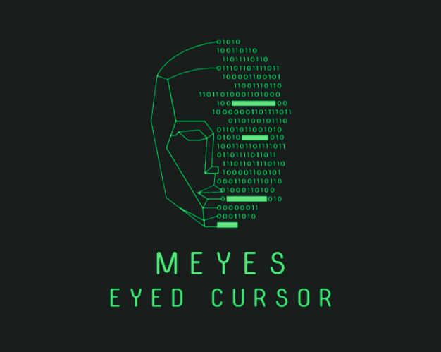

# Meyes - [Eye Control]

[]()



Imagine controlling your computer with your eyes. This is what Meyes does. It is a simple python script that uses the dlib library to detect the eyes and move the cursor accordingly. It also uses the pyautogui library to click and double click.

## Installation


```bash
pip install -r requirements.txt
```

## Usage

```python
python eye_control.py
```

## Flow of Control

- [x] OpenCV to capture the video from the webcam
- [x] Google’s MediaPipe to detect the face and the eyes
- [x] PyAutoGUI to move the cursor and click


## Contributing

Pull requests are welcome. For major changes, please open an issue first to discuss what you would like to change.


## Contributors
[](https://twitter.com/AkshatK99016584)
* maybe you? 😏

## Acknowledgements
* [OpenCV](https://opencv.org/)
* [Dlib](http://dlib.net/)
* [PyAutoGUI](https://pyautogui.readthedocs.io/en/latest/)
* [Face Recognition](https://en.wikipedia.org/wiki/Facial_recognition_system)
